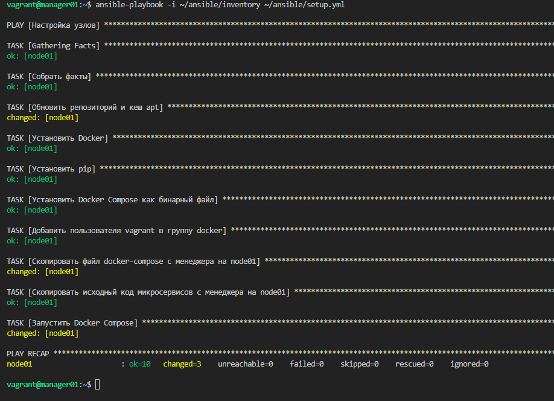
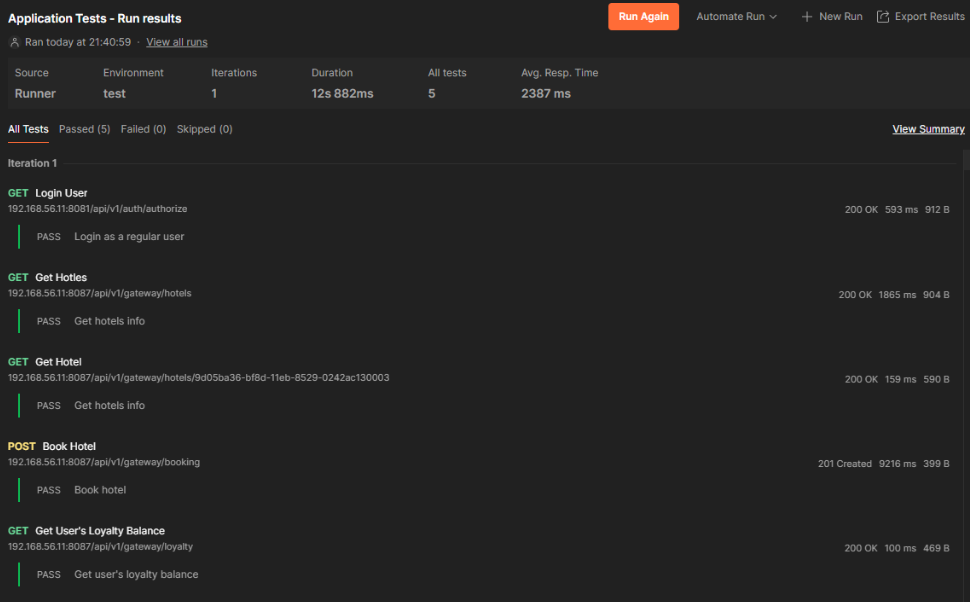
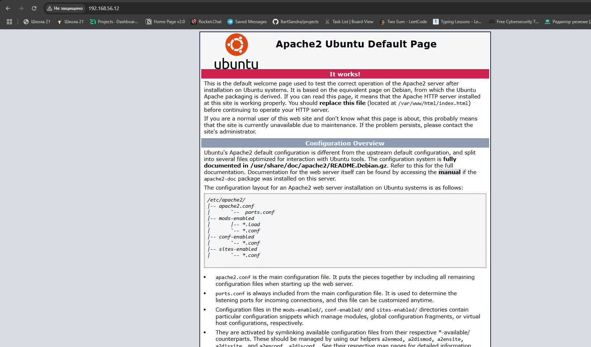
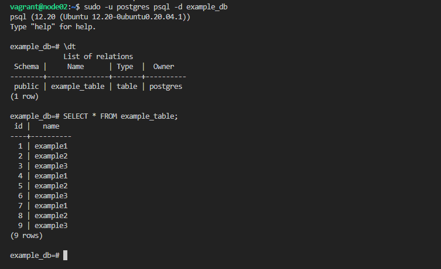
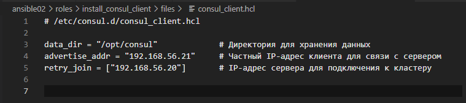
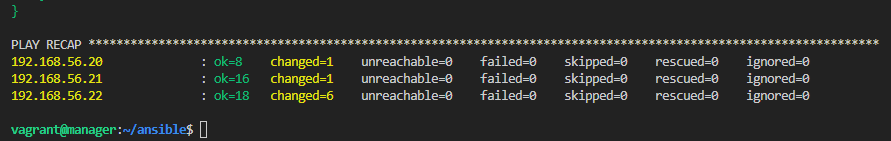

## Part 1. Удаленное конфигурирование узла через Ansible

При развертывании приложения на узле, будь то продакшн или тестовый стенд, необходимо подготовить машину для деплоя. Docker-образ уже содержит все зависимости для приложения, но некоторые настройки могут потребовать дополнительной конфигурации. Это может включать установку пакетов и инструментов (например, Docker или Git), настройку параметров, специфичных для узла, или перенос файлов. Для автоматизации этих процессов мы используем Ansible, который позволяет управлять настройками серверов удаленно.

1) Создать с помощью Vagrant три машины - manager, node01, node02. Не устанавливать с помощью shell-скриптов docker при создании машин на Vagrant! Прокинуть порты node01 на локальную машину для доступа к пока еще не развернутому микросервисному приложению.


запускаем командой: `vagrant up`


2) Подготовим manager как рабочую станцию для удаленного конфигурирования.
    1. Зайти на `manager`: ```vagrant ssh manager ```
     
    2. Сгенерировать ssh-ключи для `manager`: ```ssh-keygen -t rsa -b 2048 -N "" -f ~/.ssh/id_rsa ``` 
    
    3. Скопировать публичный ключ на `node01`: ```ssh-copy-id -i ~/.ssh/id_rsa.pub vagrant@192.168.56.11 ``` 
    
     
    4. Установить Ansible на `manager`: ```sudo apt update``` ```sudo apt install ansible ``` 
    
    5. Создать папку ansible и inventory-файл:  

    Файл inventory в Ansible используется для определения узлов (хостов), на которые будут направлены задания (tasks) и плейбуки (playbooks). Это ключевой компонент Ansible, который позволяет группировать хосты и указывать их параметры.    
     
    
    Использовать модуль ping для проверки подключения через Ansible     
     
    
    Теперь мы готовы к написанию первого плейбука! 
    
    6. Скопировать на `manager` docker-compose файл и исходный код микросервисов (используя проект из папки `src` и docker-compose файл из предыдущей главы): 

     
    

3) Напишем первый плейбук для Ansible, который выполняет apt update, устанавливает docker, docker-compose, копирует compose-файл из manager'а и разворачивает микросервисное приложение.  


4) С помощью команды ```ansible-playbook -i ~/ansible/inventory ~/ansible/setup.yml``` запустим написанный плейбук.


5) На машине node01 проверим все ли работает ```docker ps```.  


6) Прогоним заготовленные тесты через postman и удостоверимся, что все они проходят успешно.  


7) Сформируем три роли:
    1) роль application выполняет развертывание микросервисного приложения при помощи docker-compose,
    2) apache устанавливает и запускает стандартный apache сервер
    3) postgres устанавливает и запускает postgres, создает базу данных с произвольной таблицей и добавляет в нее три произвольные записи.

```
cd ~/ansible    
ansible-galaxy init roles/application   
ansible-galaxy init roles/apache    
ansible-galaxy init roles/postgres  
```

Команда `ansible-galaxy init` используются для инициализации новых ролей в Ansible. Каждая из этих команд создает структуру каталогов и файлы, которые необходимы для организации и использования ролей.


8) Для каждой роли распишем свои задачи в соответствующих файлах

src/ansible01/roles/apache/tasks/main.yml,    
src/ansible01/roles/application/tasks/main.yml,     
src/ansible01/roles/postgres/tasks/main.yml   

10) Создадим плейбук для применения ролей.  


11) Запустим плейбук `ansible-playbook -i ~/ansible/inventory ~/ansible/playbook.yml`


11) Перейдем к тестам: 
    1) Тесты Postman  
    
    2) Тесты Apache(откроем в браузере веб-страницу и получим стартовую страницу apache)  
    

    3) Подключимся к node02 и проверим создалась ли база данных.  

Подключаемся к базе данных example_db под пользователем postgres: `sudo -u postgres psql -d example_db`

Чтобы убедиться, что данные были вставлены, выполняем SQL-запрос: `SELECT * FROM example_table`




## Part 2. Service Discovery

Теперь перейдем к обнаружению сервисов. В этой главе тебе предстоит cымитировать два удаленных сервиса - api и БД, и осуществить между ними подключение через Service Discovery с использованием Consul.

В современных веб-приложениях сервисы часто взаимодействуют между собой, и если один сервис перемещается на другой IP-адрес, это может нарушить связи между сервисами. Чтобы решить эту проблему, используется Service Discovery. Один из инструментов для этого — Consul, который автоматизирует процесс обнаружения и подключения сервисов.

1) Написать два конфигурационный файла для consul (информация по consul в материалах):
- consul_server.hcl:    

настроить агент как сервер;
указать в advertise_addr интерфейс, направленный во внутреннюю сеть Vagrant


- consul_client.hcl:    

настроить агент как клиент;
указать в advertise_addr интерфейс, направленный во внутреннюю сеть Vagrant



Эти файлы будут указывать интерфейс внутренней сети Vagrant для связи между сервисами.

2) Создать с помощью Vagrant три машины - consul_server, api и db.

Прокинуть порт 8082 с api на локальную машину для доступа к пока еще не развернутому api
Прокинуть порт 8500 с manager для доступа к ui consul.


`vagrant up`


3) Напишем плейбук для ansible и четыре роли

```
cd ~/ansible
ansible-galaxy init roles/install_consul_server
ansible-galaxy init roles/install_consul_client
ansible-galaxy init roles/install_db
ansible-galaxy init roles/install_hotels_service
```

4) Запустим наш плейбук  

`ansible-playbook -i ~/ansible/inventory ~/ansible/playbook.ym`



5) Убедимся что на нашей машине api сервис запустился  


Создадим новую запись: 


В этом отчете описан процесс автоматизации провизии узлов с помощью Ansible и настройки Service Discovery с использованием Consul. Мы настроили удаленную конфигурацию узлов, развернули микросервисное приложение и настроили автоматическое обнаружение и подключение сервисов. Выполненная работа значительно упрощает процесс развертывания и управления инфраструктурой.